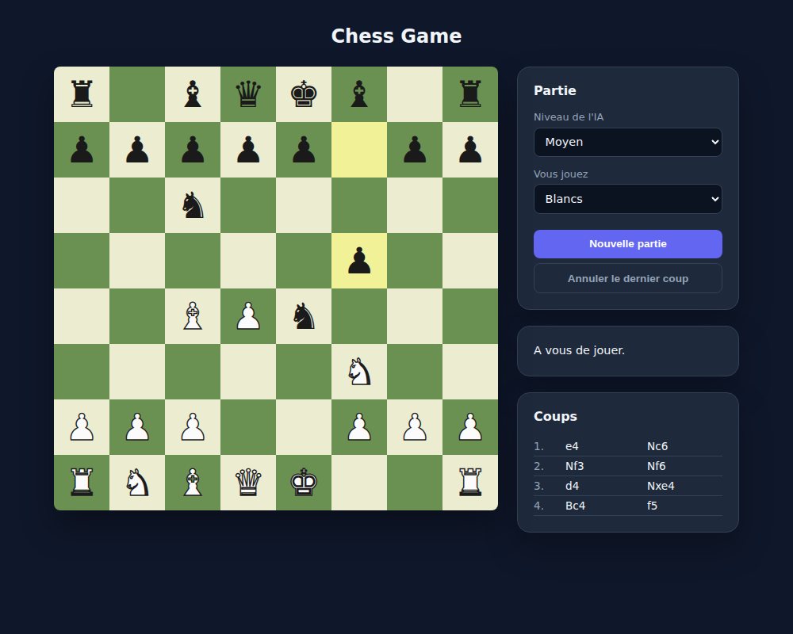
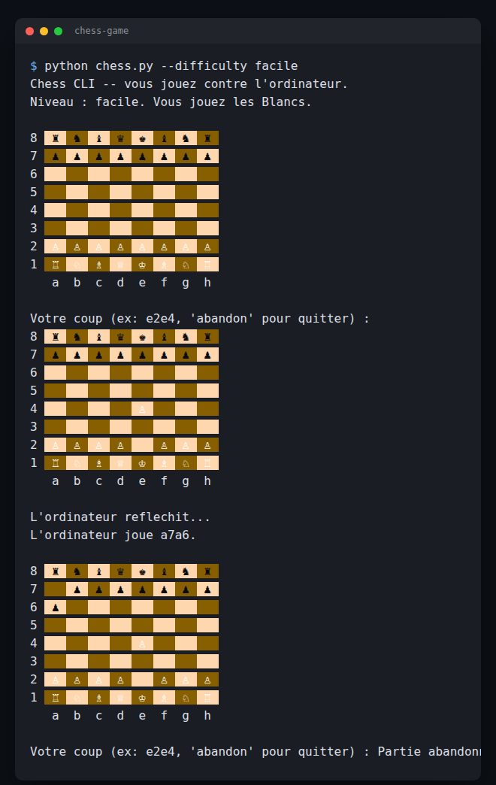

# Chess Game

A full chess implementation, built from scratch, with two front ends -- a
Python terminal client and a JS web app -- both playing against an AI with
four difficulty levels. No chess library anywhere: move generation, every
special rule, game-end detection, and the AI's search are all original code,
validated with [perft](https://www.chessprogramming.org/Perft), the standard
technique for proving a move generator correct.

[](https://github.com/Elilou14/chess-game/actions/workflows/ci.yml)
[](LICENSE)

**Live demo:** https://elilou14.github.io/chess-game/



## Features

- **Complete rules**: castling (both sides, with the through-check and
  into-check restrictions), en passant, promotion to any piece, check,
  checkmate, stalemate, the 50-move rule, threefold repetition, and
  insufficient material.
- **Four AI difficulty levels** -- facile, moyen, difficile, impossible --
  see [How the AI works](#how-the-ai-works) below for exactly what each one
  does.
- **Python CLI**: colored ASCII board with Unicode pieces, algebraic move
  input (`e2e4`, or `e7e8q` for a promotion).
- **Web app**: click-to-move with legal-move highlighting, a promotion
  picker, a move-history panel in Standard Algebraic Notation (`1. e4 Nc6`),
  undo, and a difficulty you can change mid-game.
- Play either color against the computer, in both front ends.



## Try it

```bash
git clone https://github.com/Elilou14/chess-game.git
cd chess-game
python python/chess.py --difficulty difficile --color b
```

Or open `web/index.html` in a browser (or serve the `web/` folder) -- no
build step, no dependency install.

## How the AI works

Every difficulty is the same evaluation function fed into the same
alpha-beta search, just with a different depth/time budget:

- **Facile**: a random legal move. Genuinely easy to beat.
- **Moyen**: depth-2 search, no quiescence.
- **Difficile**: depth-4 search with quiescence (see below).
- **Impossible**: iterative deepening up to depth 8, quiescence on, a ~5s
  time budget per move -- and it stops early the moment it finds a forced
  mate, rather than burning the rest of the budget on a position it's
  already won.

**Evaluation** is material (standard piece values) plus
[Michniewski's simplified piece-square tables](https://www.chessprogramming.org/Simplified_Evaluation_Function)
-- a small per-square bonus/penalty per piece type that rewards, e.g., a
knight near the center over one stuck in a corner.

**Search** is [negamax](https://www.chessprogramming.org/Negamax) with
[alpha-beta pruning](https://www.chessprogramming.org/Alpha-Beta) and
MVV-LVA move ordering (try the most promising captures first, so pruning
cuts more of the tree). Difficile and impossible also run a
[quiescence search](https://www.chessprogramming.org/Quiescence_Search) at
the horizon -- instead of stopping mid-capture-exchange and misjudging the
material, it keeps searching captures a few plies further until the
position is "quiet."

**Honest scope note**: this is a hobby-strength engine tuned for a few
seconds per move on ordinary hardware, not a Stockfish competitor.
"Impossible" means strong enough to beat the large majority of casual and
intermediate players, not superhuman.

The web version runs the AI in a Web Worker so a 5-second "impossible"
search doesn't freeze the page -- the board, status message and controls
all stay responsive while it thinks.

## Verifying the move generator: perft

Chess move generation has a lot of interacting edge cases (a pin that also
involves en passant, castling rights lost by capture rather than by moving
the king or rook, ...), and unit tests for each rule in isolation don't
prove they're all correct *together*. [Perft](https://www.chessprogramming.org/Perft)
does: it counts every leaf node of the legal-move tree at a given depth,
and that count is compared against published-correct values for
well-studied positions.

Both engines match these exactly:

| Position | Depth | Expected nodes |
|---|---|---|
| Starting position | 1 | 20 |
| Starting position | 2 | 400 |
| Starting position | 3 | 8,902 |
| Starting position | 4 | 197,281 |
| [Kiwipete](https://www.chessprogramming.org/Perft_Results#Position_2) (castling + en passant + pins, all interacting) | 1-3 | 48 / 2,039 / 97,862 |

## Architecture

Both languages follow the same module split, each function taking a state
in and returning new data out -- no mutation, no hidden globals:

| Module | Responsibility |
|---|---|
| `chess_logic.py` / `chess-logic.js` | Board representation, ordinary piece movement, `applyMove`, FEN loading |
| `chess_check.py` / `chess-check.js` | Attack detection, legal-move filtering (does a move leave the mover's own king in check?) |
| `chess_special.py` / `chess-special.js` | Castling and en passant generation; the complete legal-move generator |
| `chess_end.py` / `chess-end.js` | Checkmate/stalemate/draw detection |
| `chess_perft.py` / `chess-perft.js` | The perft validator above |
| `chess_ai.py` / `chess-ai.js` | Evaluation, search, difficulty presets |
| `chess_board_render.py` / (web CSS) | Board rendering |
| (web only) `chess-notation.js` | SAN move formatting |

`node/` is the engine's Node.js port with its own `node:test` suite -- it
isn't a separate CLI, it's what the web app is actually built from. The
files under `web/` are copies of the ones in `node/`: this project has no
build step or bundler, so the browser needs the real files on disk to
import directly.

## Running the tests

```bash
# Python (134 tests)
python -m unittest discover -s python/tests -v

# Node.js (156 tests)
cd node && node --test
```

290 tests total: every piece type's movement in isolation, check/pin/
discovered-check scenarios (including the famous "en passant pin" edge
case), castling and en passant's full rule set, draw detection, the perft
suite above, the AI finding scripted mate-in-1s and hanging pieces, and SAN
formatting including disambiguation.

## CI/CD

- **CI** (`.github/workflows/ci.yml`) runs the Python suite (3.10, 3.11,
  3.12) and the Node suite on every push and pull request to `main`.
- **Deploy Pages** (`.github/workflows/deploy-pages.yml`) publishes `web/`
  to GitHub Pages whenever it changes on `main`.

## License

MIT -- see [LICENSE](LICENSE).
